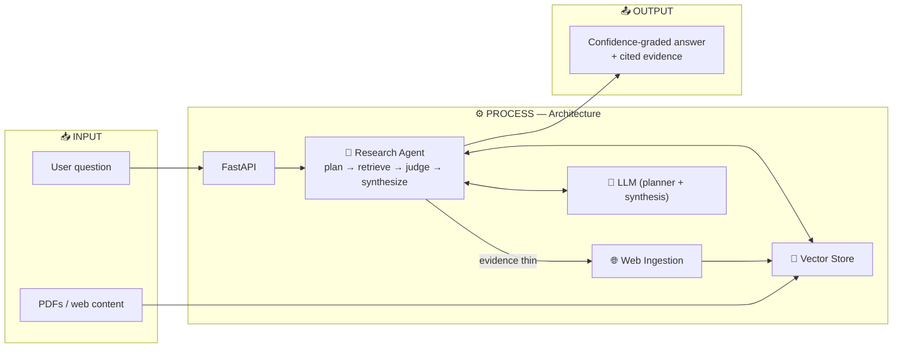

<h1 align="center">🔍 DocIntel Agent - Agentic RAG Research Assitant</h1>

<p align="center">
  <b>Agentic RAG research assistant — v2.0.0</b><br/>
  A bounded agent that plans, retrieves evidence from a vector store, fetches missing sources from the web,<br/>
  and returns <b>confidence-graded</b> answers — served behind FastAPI.
</p>

<p align="center">
  
  
  
  
  
</p>

---

## 📖 Overview

**DocIntel Agent** is a document-intelligence research assistant. It ingests **PDFs and web content** into a persistent vector store and answers questions in one of two modes:

- **`rag`** — single-shot retrieval-augmented generation
- **`agent`** — a bounded agentic loop that **plans → pre-fetches → judges evidence → fetches the web if thin → synthesizes** a confidence-graded answer

### ✨ Highlights

- 🧠 **Two LLMs, one provider** — a small *planner* model emits a JSON plan; a larger *synthesis* model writes the answer (both via one Ollama/vLLM server)
- 📊 **Confidence-tagged retrieval** — every chunk is tagged `HIGH / MEDIUM / LOW / VERY_LOW`; the synthesizer changes tone to match
- 🌐 **5 ingestion sources** — Wikipedia, arXiv, GitHub, StackOverflow, GeeksforGeeks
- 🎯 **Cosine-space embeddings** — normalized vectors in a `hnsw:space=cosine` collection for meaningful scores
- 🔁 **Self-healing registry** — orphaned document metadata is auto-detected and reset on startup

---

## 🏗️ Architecture



The agent runs in two modes — **`rag`** (single-shot retrieval + answer) and **`agent`** (plan → pre-fetch → judge evidence → fetch the web if thin → synthesize). When retrieved evidence is weak, it ingests fresh sources before answering.

---

## 🧩 Key Design Decisions

| Decision | Why it matters |
|---|---|
| **Two LLMs, one base URL** | `load_llm()` (synthesis) + `load_planner_llm()` (planning) both hit `LLM_BASE_URL`. If `PLANNER_MODEL` is unset, both share the model. |
| **Cosine-space v2 collection** | `docintel_documents_v2` forces `hnsw:space=cosine` with normalized embeddings. Bump the collection name if you change either setting. |
| **Never-filter retrieval** | `retrieve_with_scores()` always returns top-k; the agent reads scores to decide on a web fetch. |
| **Singleton services** | `DocumentService` & `SessionService` are `@lru_cache` singletons; `ResearchAgent` is per-request and reuses them. |
| **Keyword fallback** | If planner JSON fails after `PLANNER_JSON_RETRIES`, `_infer_sources()` applies keyword heuristics. |

---

## 🧰 Tech Stack

| Layer | Technologies |
|---|---|
| **API** | FastAPI · Pydantic Settings |
| **Orchestration** | LangChain · custom `ResearchAgent` loop |
| **Vector store** | ChromaDB (cosine, HNSW) |
| **Embeddings** | `sentence-transformers/all-MiniLM-L6-v2` |
| **LLM** | Ollama / vLLM / llama.cpp via `ChatOpenAI` (default `qwen3:14b`) |
| **Ops** | Docker · pytest CI |

---

## 🚀 Getting Started

```bash
# Start the API server (reads .env)
python run.py

# Hot-reload dev mode
uvicorn src.api.main:app --reload

# Tests
pytest -q
pytest tests/test_ingestion.py::test_chunk_documents_splits_text -v
```

> **CI:** `pytest -q` → `docker build` runs on every push to `main`.

---

## ⚙️ Configuration

All settings live in `src/config/settings.py` (`pydantic_settings`, loaded from `.env`; `get_settings()` is `@lru_cache`d).

| Setting | Default |
|---|---|
| `LLM_MODEL` | `qwen3:14b` |
| `LLM_BASE_URL` | `http://localhost:11434/v1` (Ollama) |
| `EMBEDDING_MODEL` | `sentence-transformers/all-MiniLM-L6-v2` |
| `CHUNK_SIZE` / `CHUNK_OVERLAP` | `800` / `120` |
| `RETRIEVAL_SCORE_THRESHOLD` | `0.30` |
| `MIN_RELEVANT_DOCS` | `2` |
| `SESSION_TTL_MINUTES` | `60` |
| `RATE_LIMIT_PER_MINUTE` | `30` |

---

## ⚠️ Error Handling

All application errors extend `DocIntelError` (`src/core/exceptions.py`). The FastAPI exception handler maps them to HTTP status codes automatically; `ScrapeError` is handled separately with a `422`.

---

<p align="center">
  <a href="https://www.linkedin.com/in/abbunitheesreddy/"></a>
  <a href="https://github.com/AbbuNitheesReddy"></a>
  <a href="mailto:nithish.7098@gmail.com"></a>
</p>
<p align="center"><i>Built by Abbu Nithees Reddy</i></p>
